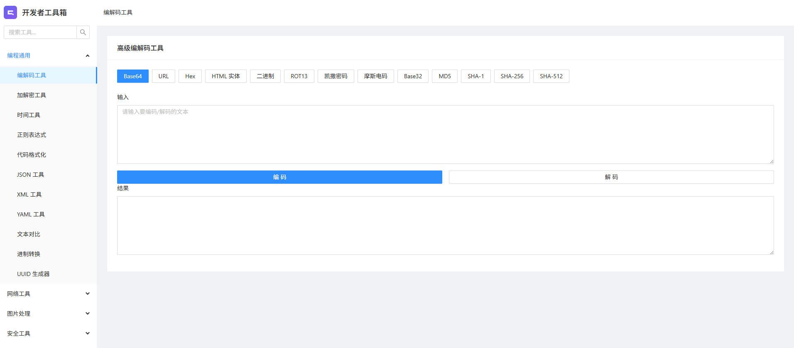

# 开发者工具箱

## 项目简介

这是一个现代化的开发者工具箱 Web 应用，提供多种实用的开发工具，全部在浏览器端运行，同时也已打包electron在Windows系统的安装包，请在release下载

## 技术栈

- Vue 3
- Ant Design Vue
- Vue Router

## 截图



## 安装与运行

```bash
# 克隆项目
git clone https://github.com/yourusername/developer-toolbox.git

# 进入项目目录
cd developer-toolbox

# 安装依赖
pnpm install

# 启动开发服务器
pnpm run serve

# 构建生产版本
pnpm run build

# 构建Tauri 客户端
pnpm run tauri:build
```
## 功能模块

- 编程通用
  - 编解码工具
  - 加解密工具
  - 时间工具
  - 正则表达式
  - 代码格式化
  - JSON 工具
  - XML 工具
  - YAML 工具
  - 文本对比
  - 文本去重
  - 进制转换
  - UUID 生成器
- 网络工具
  - User-Agent 解析
  - IP 工具集
- 图片处理
  - 二维码工具
  - SVG 编辑器
  - 图片转换器
- 安全工具
  - 密码强度评估
  - 密码生成器
  - 证书解析器
  - OpenSSL 命令生成器
  - JWT 解码器

## 公众号地址:


## 许可证

GPLV3

## 声明

此项目开发的初衷是提供日常开发时常用各类工具或教育学习使用。

本项目**严格禁止一切通过本程序进行的违反任何国家法律行为**，请在合法范围内使用本程序。

本人不会上传未公开的漏洞利用，也不允许工具中存在破坏性的语句，本项目未进行网络扫描等恶意行为，只通过代码处理开发中遇到的常见问题。

使用本程序则**默认视为**你**同意**我们的规则，请您务必遵守**道德与法律准则**。

如不遵守，**后果自负**，开发者将不承担任何责任！


